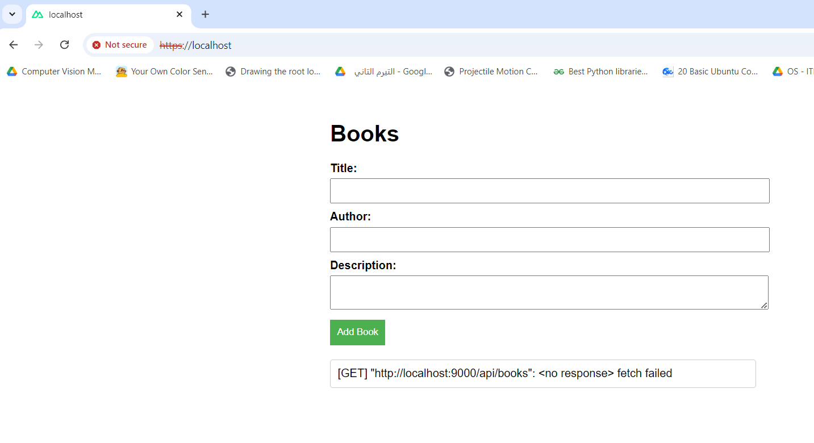

# Rayagate Challenge

## Description
 This repository contains a multi-service application built using Docker, Laravel (API), and Nuxt.js (Client), orchestrated by Nginx. The API connects to a MySQL database, while the Client is served through Nginx, supporting HTTPS via a self-signed certificate.

## Prerequisites
- Docker
- Docker Compose

## Setup Instructions

1. **Clone the Repository**:
   ```bash
   git clone https://github.com/your_username/your_repository.git
   cd your_repository

2. **Create .env Files**:

In the api directory, create a .env file using .env.example and configure the database connection.
In the client directory, create a .env file.

3. **Generate SSL Certificates**:
   ```bash	
   mkdir -p nginx/certs
   openssl req -x509 -nodes -days 365 -newkey rsa:2048 -keyout nginx/certs/nginx-selfsigned.key -out nginx/certs/nginx-selfsigned.crt

4. **Build and Start Services**:
   ```bash
   docker-compose up --build

5. **Access the Application**:

   Client: http://localhost:80
   API: http://localhost:9000/api

## CI/CD Pipeline
This project includes a CI/CD pipeline using GitHub Actions that builds Docker images and pushes them to Docker Hub.


## Application Screenshot
